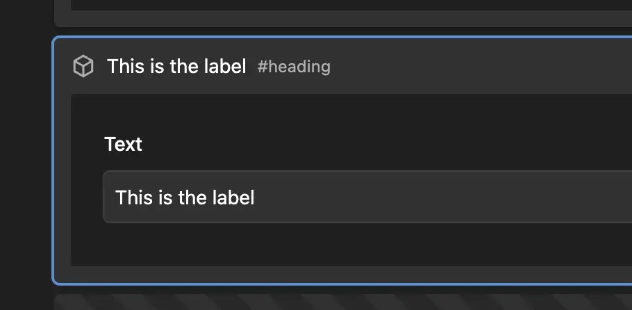
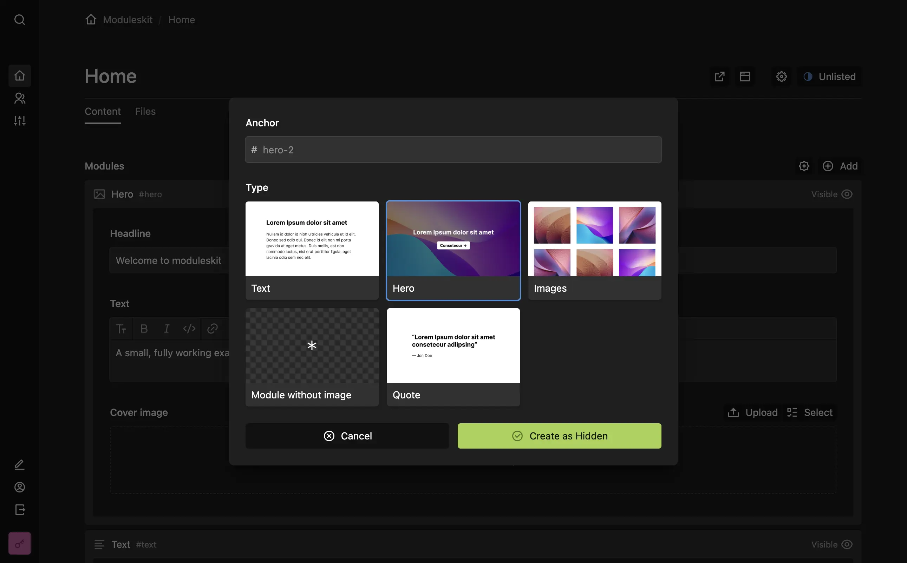

# Kirby Modules

Modular page building for [Kirby](https://getkirby.com/). Every module is a regular page with its own blueprint and snippet, edited inline on the parent page.


- Edit module fields inline on the parent page with a blocks-like UI
- Signed previews for hidden modules
- Great performance with large numbers of modules
- Robust multilanguage behaviour
- Automatic container page creation, separating modules from regular subpages
- Multiple modules sections per page
- Sensible defaults in module blueprints

## Installation

The plugin requires Kirby 5.

```
composer require medienbaecker/kirby-modules
```

Or download this repository and put it into `site/plugins/modules`.

## Quick Start

> Prefer to see everything wired up? The [moduleskit](https://github.com/medienbaecker/moduleskit) is a small, ready-to-run example site.

**1. Add a modules section** to a page blueprint:

```yml
# site/blueprints/pages/default.yml
title: Default Page
sections:
  modules:
    type: modules
```

**2. Create a module type** with a blueprint for its fields and a snippet for its HTML:

```yml
# site/blueprints/modules/text.yml
title: Text
fields:
  textarea:
    label: Text
```

```php
// site/snippets/modules/text.php
<div id="<?= $module->slug() ?>">
  <?= $module->textarea()->kt() ?>
</div>
```

Or create both files in one go using the built-in [CLI](https://github.com/getkirby/cli) command:

```bash
kirby make:module text
```

**3. Render the modules** in your template:

```php
// site/templates/default.php
<?= $page->modules() ?>
```

## How It Works

A module is a regular page, set apart only by living inside a modules container. That way pages can act as modules without sacrificing regular subpages:

```
Page
├── Subpage A
├── Subpage B
└── Modules
    ├── Module A
    └── Module B
```

The container is created automatically and stays out of the way. Editors only ever see the modules section on the parent page. Because modules are pages, everything you know about pages applies: module blueprints support the full Kirby blueprint layout, including [columns](https://getkirby.com/docs/guide/blueprints/layout#columns) and [sections](https://getkirby.com/docs/guide/blueprints/layout#sections), and modules can have their own files, translations and models.

### Naming

A module type is defined by two files sharing one name:

- `site/blueprints/modules/text.yml` for the fields
- `site/snippets/modules/text.php` for the HTML

Internally, the module page's template gets a prefix: a `text` module is a page with the template `module.text`. You don't need to remember which form goes where: every plugin option (`templates`, `templatesIgnore`, `default`) accepts both `text` and `module.text`.

## Editing in the Panel

Modules are edited inline on the parent page: expand or collapse them, sort them by dragging or with the keyboard, and use the toolbar on each card to edit, preview, duplicate, add or delete.

### Visibility

Each module's visibility can be toggled with a single click on its card. Hidden modules stay in place, keeping their sort position and any inline edits, but the frontend skips over them when rendering. The card shows a striped background while a module is hidden.

New modules are created hidden, so editors can prepare content before it goes live. Set the [`autopublish` option](#config-options) to create them visible instead.

Every module card has a preview button. Visible modules link to the module's anchor on the live page. Hidden modules get a signed preview URL (token + `_module` query param) instead, so authors can verify them on the live URL without a Panel login.

### Anchors

A module's slug doubles as its anchor. Use it as the element ID in your snippet:

```php
<div id="<?= $module->slug() ?>">
```

The anchor is always visible on the module card (e.g. `#text`) and can be changed by clicking it, or via "Change anchor" in the toolbar's dropdown.

### Labels

Every module shows its type's, or rather its blueprint's `title`. The `label` option in the module blueprint can be used to overwrite this with a field:

```yml
# site/blueprints/modules/text.yml
title: Text
label: "{{ module.headline }}"
fields:
  headline:
    type: text
```



It's a [query](https://getkirby.com/docs/guide/blueprints/query-language) resolved from the module's fields and refreshed on every save, so a text module shows its current headline. An empty result falls back to the title.

To give a brand-new module a meaningful label right away, also ask for that field in the [create dialog](#customizing-the-create-dialog).

### Changing types

"Change type" in the toolbar's dropdown switches a module to another type. Fields keep their content when the new blueprint has a field with the same name and type.

### Customizing the create dialog

By default the create dialog asks for the module's type (when there's more than one) and its [anchor](#anchors), nothing more. Add a `create` block to a module blueprint, like [Kirby's page creation dialog](https://getkirby.com/docs/reference/panel/blueprints/page#page-creation-dialog), to ask for fields up front or fill the anchor automatically.

#### Asking for fields up front

List the fields you want in the dialog under `create.fields`, in the order they should appear:

```yml
# site/blueprints/modules/text.yml
title: Text
create:
  fields:
    - headline
fields:
  headline:
    type: text
  text:
    type: textarea
```

Use it for the things worth setting before the module exists; everything else is edited inline afterwards. Only fields that fit in a dialog work here: text, number, select, date, toggle, link and the like. A textarea, blocks or structure field (or the reserved name `title`) can't be shown and raises an error. That's why the example asks only for the `headline`; the `text` body is a textarea, so you fill it in inline. A `required` field has to be listed here or have a `default`. Kirby normally creates a page as a draft to finish later; a module skips that, so every required field must be satisfied at creation.

#### Filling the anchor automatically

By default the editor types the anchor. Set `create.anchor` and they don't: a query fills it from the content, or `false` builds one from the type name.

```yml
create:
  anchor: "{{ module.headline }}"
```

It uses the same query syntax as [`label`](#labels), and the result is always made unique (`#intro`, `#intro-2` and so on). For a date or time field, format it in the query, for example `{{ module.date.toDate('Y') }}`.

### Preview images

Add preview images to make the create and change-type dialogs show a visual grid instead of a dropdown. Drop images into `assets/module-previews/`, named after the module, for example `text.png` for the `text` module. Any image format works; a 16:9 ratio looks best.



Types without a matching image fall back to their blueprint `icon`. If no type has a preview image, the dialogs keep the plain dropdown. With a single module type there's nothing to pick, so no picker appears and the dialog goes straight to the fields.

### Concurrent editing

Module edits are unsaved changes, published with the page's own Save button. While someone has unsaved module edits, the whole page is locked for everyone else, using Kirby's native lock: they see who is editing and all fields and modules become read-only.

Kirby releases a lock 10 minutes after the last edit. If someone leaves without saving, their changes wait for the next editor, and the page header names who made them, just like on any other page. Saving publishes them, discarding removes them.

## Section Options

| Option            | Type     | Description                                    |
| ----------------- | -------- | ---------------------------------------------- |
| `default`         | `string` | Pre-selected module type in the create dialog  |
| `templates`       | `array`  | Manually define available types instead of all |
| `templatesIgnore` | `array`  | Hide specific module types                     |
| `min`             | `int`    | Minimum number of modules                      |
| `max`             | `int`    | Maximum number of modules                      |
| `sortable`        | `bool`   | Set to `false` to disable manual sorting       |
| `label`           | `string` | Section headline (default: "Modules")          |
| `empty`           | `string` | Empty state text                               |

Type names work with or without the `module.` prefix.

### Multiple sections

Each section's name (the YAML key) becomes its container's slug, so a page can have several independent module areas:

```yml
sections:
  modules:
    type: modules
    default: text
  sidebar:
    type: modules
    templates:
      - cta
      - newsletter
```

```php
// Default container for the section called `modules`
<?= $page->modules() ?>

// Secondary container for the section called `sidebar`
<?= $page->modules('sidebar') ?>
```

## Rendering

`$page->modules()` returns the visible modules as a collection; echoing it renders every module's snippet:

```php
<?= $page->modules() ?>
```

`renderModules()` does the same and can pass extra variables into every snippet:

```php
<?php $page->renderModules(['theme' => 'dark']) ?>

// or for a named container:
<?php $page->renderModules('sidebar', ['theme' => 'dark']) ?>
```

Inside a snippet, `$module` is the module page and `$page` is the parent page. Variables from [controllers](https://getkirby.com/docs/guide/templates/controllers) are also available.

Modules also work on the site itself: add a modules section to `site.yml` and use `$site->modules()` in your templates.

## Template Methods

| Method                          | Description                                                  |
| ------------------------------- | ------------------------------------------------------------ |
| `$page->modules()`              | All visible modules (default container)                      |
| `$page->modules('sidebar')`     | Modules from a named container                               |
| `$page->renderModules($params)` | Render all modules, optionally passing variables             |
| `$page->createModule($props)`   | Create a module from code                                    |
| `$page->hasModules()`           | Page has a modules section                                   |
| `$page->isModule()`             | Page is a module                                             |
| `$module->isHidden()`           | Module is hidden (always reads the default language)         |
| `$page->filePool()`             | Files for blueprint queries (host page if module, else self) |
| `$module->moduleId()`           | CSS BEM class (e.g. `module--text`)                          |
| `$module->moduleName()`         | Blueprint title                                              |

## Advanced

### File pools

By default, a files field in a module sees only that module's own files. That's okay if you want to add a files section to the module, too. Most of the time, however, you want to use the (grand)parent page's file pool.

The `filePool` method resolves to the right files collection regardless of where it's called:

- On a **module**, returns the host page's files (the module's grandparent: the page that owns the modules container).
- On any other page, the page's own files.
- On the site, file, or user, that model's own files.

Use it as the `query` of any files field that should follow this rule:

```yml
type: files
query: model.filePool
uploads:
  parent: model.filePool.parent
```

To access the page of the file pool, you can use `model.filePool.parent`, as shown in the `uploads` option.

### Custom models

Override the model for _all_ module types via config:

```php
// site/config/config.php
'medienbaecker.modules.model' => CustomModulePage::class,
```

Or override a _single_ module type via `site/models/` (as you would with any regular page):

```php
// site/models/module.text.php
class ModuletextPage extends Medienbaecker\Modules\ModulePage {
  // your methods
}
```

### Virtual modules

`Module::factory()` mirrors Kirby's `Block::factory()`: it creates a module from code and renders it with its regular snippet.

```php
use Medienbaecker\Modules\Module;

echo Module::factory([
  'type' => 'text',
  'content' => [
    'textarea' => 'Hello from code'
  ]
])->toHtml();
```

`Modules::factory()` is the plural equivalent (like `Blocks::factory()`) and renders when echoed:

```php
use Medienbaecker\Modules\Modules;

echo Modules::factory([
  ['type' => 'text', 'content' => ['textarea' => 'One']],
  ['type' => 'text', 'content' => ['textarea' => 'Two']],
]);
```

Inside the snippets, `$module` works as usual and `$page` is the current page. Virtual modules are render-only: they don't appear in the Panel.

### Creating modules from code

While `Module::factory()` is render-only, `$page->createModule()` creates a real module, stored on disk and editable in the Panel. Useful for imports, seeding and migrations:

```php
$page->createModule([
  'type' => 'text',
  'content' => [
    'textarea' => 'Imported text'
  ]
]);
```

The container is created when missing and the slug defaults to the type name (`text`, `text-2`, …). Like in the Panel, new modules respect the [`autopublish` option](#config-options), so they are created hidden by default. The method returns the created module.

The second argument targets a named container:

```php
$page->createModule($props, 'sidebar');
```

### Config options

```php
// site/config/config.php
return [
  // Create new modules visible instead of hidden (default: false)
  'medienbaecker.modules.autopublish' => true,

  // Override the page model for all module types
  'medienbaecker.modules.model' => CustomModulePage::class,
];
```

## Licensing

Kirby Modules is a commercial plugin. You can use it for free on local environments but using it in production requires a valid licence. You can pay what you want, the suggested price being 99€ per project. Feel free to choose "0" when working on a purposeful project ❤️

[Buy a licence](https://medienbaecker.com/plugins/modules)

## Credits

The visual type picker was inspired by [Juno](https://juno-hamburg.com)'s [Visual Block Selector](https://github.com/junohamburg/kirby-visual-block-selector).
