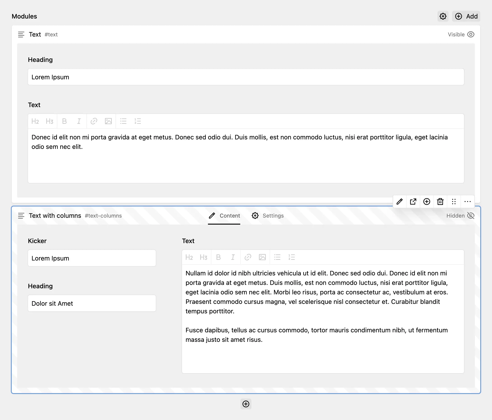

# Kirby Modules

Modular page building for [Kirby](https://getkirby.com/) using regular Kirby pages with their own blueprint and snippet, edited inline on the parent page.



## Licensing

Kirby Modules is a commercial plugin. You can use it for free on local environments but using it in production requires a valid licence. You can pay what you want, the suggested price being 99€ per project. Feel free to choose "0" when working on a purposeful project ❤️

[Buy a licence](https://medienbaecker.com/plugins/modules)

## Features

- Edit module fields inline on the parent page with a blocks-like UI
- Draft previews for individual modules
- Great performance with large numbers of modules
- Robust multilanguage behaviour
- Automatic container page creation, separating modules from regular subpages
- Multiple modules sections per page
- Sensible defaults in module blueprints

## Installation

```
composer require medienbaecker/kirby-modules
```

Or download this repository and put it into `site/plugins/kirby-modules`.

## What's a Module?

A module is a regular page, differentiated from other pages by being inside a modules container. This makes it possible to use pages as modules without sacrificing regular subpages.

```
Page
├── Subpage A
├── Subpage B
└── Modules
    ├── Module A
    └── Module B
```

## Quick Start

Add a ([or multiple](#multiple-sections)) modules section to your page blueprint:

```yml
# site/blueprints/pages/default.yml
title: Default Page
sections:
  modules:
    type: modules
```

Create a module blueprint and snippet:

```yml
# site/blueprints/modules/text.yml
title: Text
fields:
  textarea:
    label: Text
```

```php
// site/snippets/modules/text.php
<div id="<?= $module->slug() ?>">
  <?= $module->textarea()->kt() ?>
</div>
```

Or create both files using the CLI command:

```bash
kirby make:module gallery
```

In your snippet, `$module` is the module page and `$page` is the parent page. Variables from [controllers](https://getkirby.com/docs/guide/templates/controllers) are also available.

Render in your template:

```php
// site/templates/default.php
<?= $page->modules() ?>
```

## Section Options

| Option            | Type     | Description                                     |
| ----------------- | -------- | ----------------------------------------------- |
| `default`         | `string` | First/pre-selected module type in create dialog |
| `templates`       | `array`  | Manually define available types instead of all  |
| `templatesIgnore` | `array`  | Hide specific module types                      |
| `min`             | `int`    | Minimum number of modules                       |
| `max`             | `int`    | Maximum number of modules                       |
| `empty`           | `string` | Empty state text                                |

## Multiple Sections

Each section's name (YAML key) becomes the container slug:

```yml
sections:
  modules:
    type: modules
    default: text
  sidebar:
    type: modules
    templates:
      - module.cta
      - module.newsletter
```

```php
// Default container for modules section called `modules`
<?= $page->modules() ?>

// Secondary container for modules section called `sidebar`
<?= $page->modules('sidebar') ?>
```

## Config Options

```php
// site/config/config.php
return [
  // Auto-publish new modules (default: draft)
  'medienbaecker.modules.create.status' => 'listed',

  // Redirect to module page after creation (default: false)
  'medienbaecker.modules.create.redirect' => true,
];
```

## Template Methods

| Method                      | Description                     |
| --------------------------- | ------------------------------- |
| `$page->modules()`          | All modules (default container) |
| `$page->modules('sidebar')` | Modules from named container    |
| `$page->hasModules()`       | Page has modules                |
| `$page->isModule()`         | Page is a module                |
| `$module->moduleId()`       | CSS class (e.g. `module--text`) |
| `$module->moduleName()`     | Blueprint title                 |

## Custom Models

Override the model for _all_ module types via config:

```php
// site/config/config.php
'medienbaecker.modules.model' => CustomModulePage::class,
```

Or override a _single_ module type via `site/models/` (as you would with any regular page):

```php
// site/models/module.text.php
class ModuletextPage extends Medienbaecker\Modules\ModulePage {
  // your methods
}
```

## Example

Check out the [example repository](https://github.com/medienbaecker/modules-example) with Kirby's plainkit and a few simple modules.
